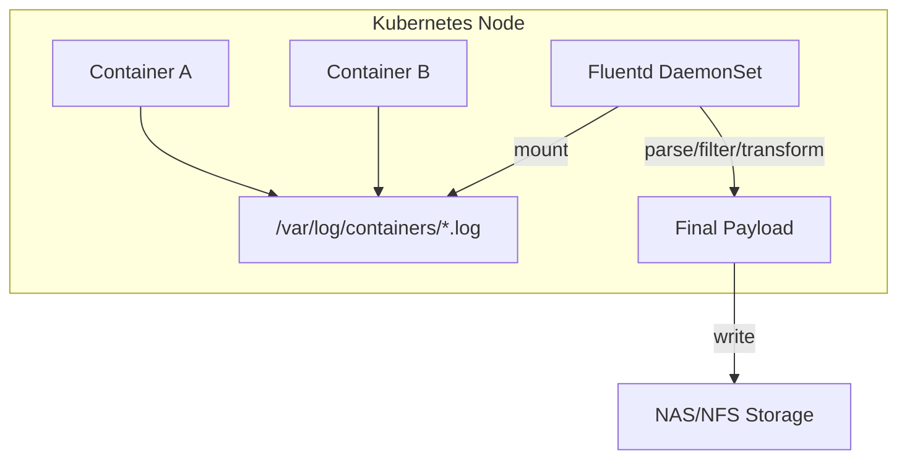
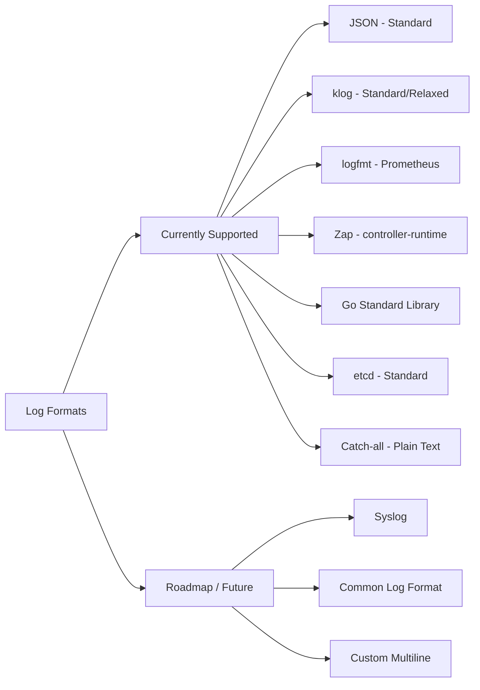

<!--
 Copyright 2026 Google LLC

 Licensed under the Apache License, Version 2.0 (the "License");
 you may not use this file except in compliance with the License.
 You may obtain a copy of the License at

      http://www.apache.org/licenses/LICENSE-2.0

 Unless required by applicable law or agreed to in writing, software
 distributed under the License is distributed on an "AS IS" BASIS,
 WITHOUT WARRANTIES OR CONDITIONS OF ANY KIND, either express or implied.
 See the License for the specific language governing permissions and
 limitations under the License.
-->

# Apigee Hybrid Custom Logger

A lightweight, high-performance custom logging solution for Apigee Hybrid using Fluentd. This project enables Apigee Hybrid customers to export logs to external storage (e.g., NFS, NAS) in a structured JSON format with custom filtering and transformation logic.

## Overview

In Apigee Hybrid, logging is typically handled by Google Cloud Logging. However, many enterprise customers require logs to be exported to on-premises storage or specific log management systems. This project provides a Fluentd-based DaemonSet that:
- **Taps into Kubernetes logs**: Reads logs directly from `/var/log/containers/`.
- **Supports Multiple Formats**: Automatically parses JSON, `klog` (standard and relaxed), `logfmt`, **Zap** (controller-runtime), and **Go Standard Library** formatted logs.
- **Enriches Metadata**: Adds Kubernetes pod, namespace, and container information.
- **Filters by Severity**: Allows filtering (e.g., only ERROR and WARN logs).
- **Transforms Payloads**: Formats logs into a custom JSON structure.
- **Log Retention**: Automated log rotation and cleanup via a scheduled CronJob.
- **Exports to Storage**: Writes logs to a mounted NAS/NFS share.

## Architecture



## Prerequisites

- **Apigee Hybrid Cluster**: A running Kubernetes cluster with Apigee Hybrid installed.
- **NEXUS/NFS Storage**: A storage backend accessible from your Kubernetes nodes.
- **`kubectl`**: Configured to access your cluster.
- **Node Taints**: If running in a hybrid or admin/user cluster environment, you may need to add [tolerations](k8s/sinks/nas/README.md#running-on-control-plane-nodes) to allow pods to run on control plane nodes.

## Supported Destinations

This project is designed to be extensible. Currently supported destinations (sinks) include:
- **NAS/NFS**: Standard file-based logging to a mounted share. (Found in `k8s/sinks/nas/`)

*Contributions for other destinations like ELK, Splunk, and Kafka are welcome!*

## Supported Log Formats

The solution currently handles multiple log formats out-of-the-box using the Fluentd `multi_format` parser.



### Supported Log Formats Matrix

The following table summarizes the component support for each log format:

| Category | Component Examples | Log Format |
| :--- | :--- | :--- |
| **Apigee Core** | Runtime, Sync, UDCA | JSON |
| **Apigee Metrics** | Metrics Adapter | klog (Standard) |
| **Infrastructure** | kube-apiserver, cert-manager | klog (Relaxed) |
| **Monitoring** | node_exporter, alertmanager | logfmt |
| **K8s Operators** | apigee-controller, metrics-operator | Zap / Controller-runtime |
| **Infrastructure** | etcd | etcd (Standard) |
| **Utilities** | Helper binaries, Generic Go | Go Standard Library |
| **Generic** | Anything else on stdout/stderr | Catch-all (Fallback) |

*Note: Automated field extraction and severity mapping are currently optimized for these formats.*

## Installation

1. **Clone the repository**:
   ```bash
   git clone https://github.com/your-org/apigee-hybrid-custom-logger.git
   cd apigee-hybrid-custom-logger
   ```

2. **Configure Base RBAC**:
   ```bash
   kubectl apply -f k8s/base/rbac.yaml
   ```

3. **Choose and Deploy a Sink**:
   Browse to a sink directory (e.g., `k8s/sinks/nas/`) and follow its specific configuration.

    **Example: Deploying NAS Sink**
    - Configure your NAS server IP (Local only):
      ```bash
      # This generates k8s/sinks/nas/daemonset.yaml and configmap.yaml
      # Usage: ./scripts/configure-nas.sh <NAS_IP> <NAS_SHARE_NAME> [MOUNT_PATH] [RETENTION_DAYS]
      ./scripts/configure-nas.sh 10.226.29.34 /vol1 /mnt/nas-logs 30
      ```
    - Apply the configuration:
      ```bash
      kubectl apply -f k8s/sinks/nas/configmap.yaml
      kubectl apply -f k8s/sinks/nas/daemonset.yaml
      kubectl apply -f k8s/sinks/nas/janitor.yaml
      ```

## Configuration

For detailed information on setting up your storage backend and the log processing logic:
- **[GCP Filestore Setup Guide](docs/gcp-setup.md)**
- **[NAS Sink Pipeline Details](k8s/sinks/nas/README.md)**

To verify your installation and test the end-to-end log flow, follow the **[Verification & Testing Guide](docs/verification-guide.md)**.

## Running Integration Tests

To ensure that changes to the Fluentd configuration do not break existing log parsing logic, an integration test suite is provided.

### Prerequisites
- **Ruby**: The tests use a native Ruby script to simulate the log processing pipeline.

### How to Run
```bash
# From the project root
./tests/integration/run.sh
```

### Adding New Test Cases
1. Add a raw log line (in CRI format) to `tests/integration/fixtures/input/<name>.log`.
2. Run the test script. It will generate a "golden" expected output in `tests/integration/fixtures/output/<name>.json`.
3. Verify the generated JSON is correct and commit it to the repository.

## Log Retention (NAS Janitor)

To prevent the NAS storage from filling up over time, this project includes a **Janitor CronJob** that handles automated log rotation.

- **Component**: `nas-janitor` (Kubernetes CronJob)
- **Schedule**: Every day at 01:00 AM.
- **Retention Policy**: Automatically deletes log directories older than **30 days**.
- **Efficiency**: Uses a lightweight Alpine-based container to perform targeted cleanup on the mounted NAS share.

See the [NAS Sink README](k8s/sinks/nas/README.md#log-retention--rotation) for detailed deployment and customization instructions.

## Hybrid & Admin/User Cluster Considerations

In hybrid environments (like Anthos), control plane components often run on tainted nodes. By default, the custom logger will not run on these nodes. See the [Running on Control Plane Nodes](k8s/sinks/nas/README.md#running-on-control-plane-nodes) section for guidance on adding the necessary tolerations.

## Log Processing Example

The solution transforms raw platform logs into a clean, standardized JSON format.

### Case 1: JSON Format (Apigee Runtime)
**Raw Log (from node):**
```text
2026-03-12T03:28:10.653Z stdout F {"level":"INFO","thread":"NIOThread@4","message":"Keep alive is false Request Connection Header [close]...","severity":"INFO","logger":"HTTP.SERVER"}
```

**Final Processed Log (on NAS):**
```json
{
  "resource": {
    "namespace": "apigee",
    "pod": "apigee-runtime-xyz",
    "container": "apigee-runtime",
    "node": "gke-node-1"
  },
  "message": "Keep alive is false Request Connection Header [close]...",
  "severity": "INFO",
  "timestamp": "2026-03-12T03:28:10.653000Z"
}
```

### Case 2: klog Format (Apigee Metric Adapter)
**Raw Log (from node):**
```text
2026-03-12T03:26:22.182Z stdout F I0312 03:26:22.182742       1 httplog.go:132] "HTTP" verb="GET" URI="/apis/custom.metrics..." resp=200
```

**Final Processed Log (on NAS):**
```json
{
  "resource": {
    "namespace": "apigee",
    "pod": "apigee-metrics-adapter-abc",
    "container": "apigee-metrics-adapter",
    "node": "gke-node-1"
  },
  "message": "\"HTTP\" verb=\"GET\" URI=\"/apis/custom.metrics...\" resp=200",
  "severity": "INFO",
  "timestamp": "2026-03-12T03:26:22.182000Z"
}
```

### Case 3: etcd Format (Infrastructure)
**Raw Log (from node):**
```text
2026-03-18 10:56:10.209165 I | etcdserver: compacted raft log at 224686110
```

**Final Processed Log (on NAS):**
```json
{
  "resource": {
    "namespace": "kube-system",
    "pod": "etcd-member-node-1",
    "container": "etcd",
    "node": "gke-node-1"
  },
  "message": "etcdserver: compacted raft log at 224686110",
  "severity": "INFO",
  "timestamp": "2026-03-18T10:56:10.209165Z"
}
```

## Catch-all Parser Mechanism

The solution includes a generic **Catch-all Parser** as the final step in the `multi_format` pipeline. This ensures that:
- **No logs are lost**: Any log line that does not match specific patterns (JSON, klog, etc.) is still captured as a raw string in the `message` field.
- **Robustness**: The pipeline continues to enrich these logs with Kubernetes metadata even if the internal application format is unknown.
- **Fallback Severity**: If no structured level is found, the system scans the message for keywords like "error" to assign a best-effort severity.

### Extending with New Destinations
To add a new destination, see the [Sink Development Guide](docs/sink-development.md).

## Authors

- **Ayush Gupta**
- **Antony Gilon**

## License
License under the [Apache License 2.0](LICENSE).
