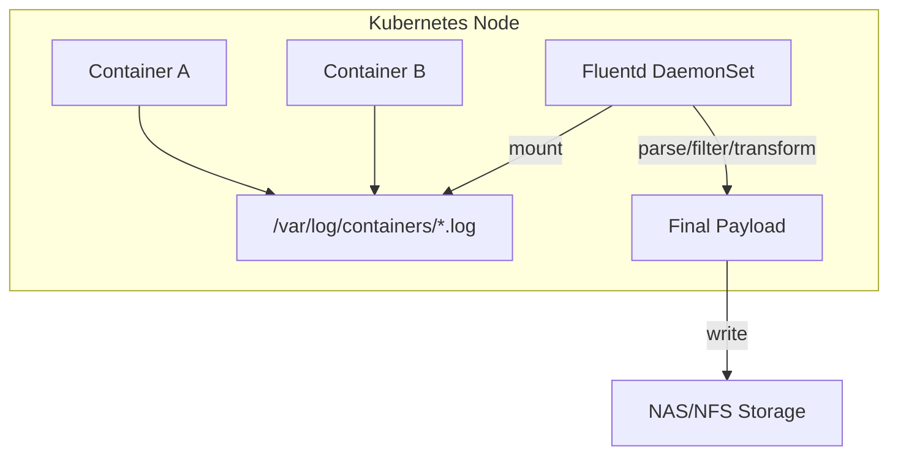
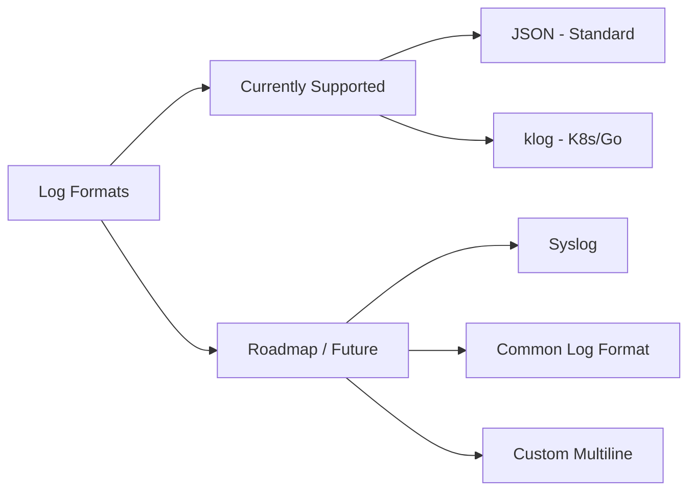

<!--
 Copyright 2026 Google LLC

 Licensed under the Apache License, Version 2.0 (the "License");
 you may not use this file except in compliance with the License.
 You may obtain a copy of the License at

      http://www.apache.org/licenses/LICENSE-2.0

 Unless required by applicable law or agreed to in writing, software
 distributed under the License is distributed on an "AS IS" BASIS,
 WITHOUT WARRANTIES OR CONDITIONS OF ANY KIND, either express or implied.
 See the License for the specific language governing permissions and
 limitations under the License.
-->

# Apigee Hybrid Custom Logger

A lightweight, high-performance custom logging solution for Apigee Hybrid using Fluentd. This project enables Apigee Hybrid customers to export logs to external storage (e.g., NFS, NAS) in a structured JSON format with custom filtering and transformation logic.

## Overview

In Apigee Hybrid, logging is typically handled by Google Cloud Logging. However, many enterprise customers require logs to be exported to on-premises storage or specific log management systems. This project provides a Fluentd-based DaemonSet that:
- **Taps into Kubernetes logs**: Reads logs directly from `/var/log/containers/`.
- **Supports Multiple Formats**: Automatically parses both JSON and `klog` formatted logs. (Note: These are currently the only two supported formats for automated parsing).
- **Enriches Metadata**: Adds Kubernetes pod, namespace, and container information.
- **Filters by Severity**: Allows filtering (e.g., only ERROR and WARN logs).
- **Transforms Payloads**: Formats logs into a custom JSON structure.
- **Exports to Storage**: Writes logs to a mounted NAS/NFS share.

## Architecture



## Prerequisites

- **Apigee Hybrid Cluster**: A running Kubernetes cluster with Apigee Hybrid installed.
- **NEXUS/NFS Storage**: A storage backend accessible from your Kubernetes nodes.
- **`kubectl`**: Configured to access your cluster.

## Supported Destinations

This project is designed to be extensible. Currently supported destinations (sinks) include:
- **NAS/NFS**: Standard file-based logging to a mounted share. (Found in `k8s/sinks/nas/`)

*Contributions for other destinations like ELK, Splunk, and Kafka are welcome!*

## Supported Log Formats

The solution currently handles multiple log formats out-of-the-box using the Fluentd `multiformat` parser.



### Format Details
- **JSON**: Standard structured logs.
- **klog**: The default logging format for Kubernetes system components and Go-based applications.

*Note: Automated field extraction and severity mapping are currently optimized for these two formats.*

## Installation

1. **Clone the repository**:
   ```bash
   git clone https://github.com/your-org/apigee-hybrid-custom-logger.git
   cd apigee-hybrid-custom-logger
   ```

2. **Configure Base RBAC**:
   ```bash
   kubectl apply -f k8s/base/rbac.yaml
   ```

3. **Choose and Deploy a Sink**:
   Browse to a sink directory (e.g., `k8s/sinks/nas/`) and follow its specific configuration.

    **Example: Deploying NAS Sink**
    - Configure your NAS server IP (Local only):
      ```bash
      # This generates k8s/sinks/nas/daemonset.yaml from a template
      # and it is automatically ignored by Git.
      ./scripts/configure-nas.sh 10.10.10.10 
      ```
    - Apply the configuration:
      ```bash
      kubectl apply -f k8s/sinks/nas/configmap.yaml
      kubectl apply -f k8s/sinks/nas/daemonset.yaml
      ```

## Configuration

For detailed information on the step-by-step logic of how logs are processed and transformed, please refer to the sink-specific pipeline documentation:
- **[NAS Sink Pipeline Details](k8s/sinks/nas/README.md)**

To verify your installation and test the end-to-end log flow, follow the **[Verification & Testing Guide](docs/verification-guide.md)**.

## Log Processing Example

The solution transforms raw platform logs into a clean, standardized JSON format.

### Case 1: JSON Format (Apigee Runtime)
**Raw Log (from node):**
```text
2026-03-12T03:28:10.653Z stdout F {"level":"INFO","thread":"NIOThread@4","message":"Keep alive is false Request Connection Header [close]...","severity":"INFO","logger":"HTTP.SERVER"}
```

**Final Processed Log (on NAS):**
```json
{
  "resource": {
    "namespace": "apigee",
    "pod": "apigee-runtime-xyz",
    "container": "apigee-runtime",
    "node": "gke-node-1"
  },
  "message": "Keep alive is false Request Connection Header [close]...",
  "severity": "INFO",
  "timestamp": "2026-03-12T03:28:10.653000Z"
}
```

### Case 2: klog Format (Apigee Metric Adapter)
**Raw Log (from node):**
```text
2026-03-12T03:26:22.182Z stdout F I0312 03:26:22.182742       1 httplog.go:132] "HTTP" verb="GET" URI="/apis/custom.metrics..." resp=200
```

**Final Processed Log (on NAS):**
```json
{
  "resource": {
    "namespace": "apigee",
    "pod": "apigee-metrics-adapter-abc",
    "container": "apigee-metrics-adapter",
    "node": "gke-node-1"
  },
  "message": "\"HTTP\" verb=\"GET\" URI=\"/apis/custom.metrics...\" resp=200",
  "severity": "INFO",
  "timestamp": "2026-03-12T03:26:22.182000Z"
}
```

### Extending with New Destinations
To add a new destination, see the [Sink Development Guide](docs/sink-development.md).

## Authors

- **Ayush Gupta**
- **Antony Gilon**

## License
License under the [Apache License 2.0](LICENSE).
